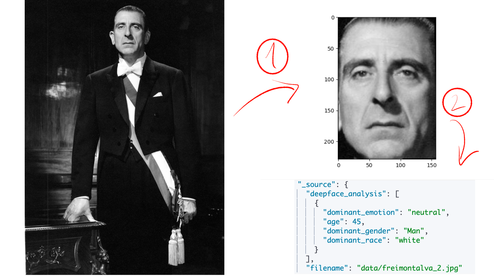

## Sample project to use DeepFace to extract faces from images, age, race, gender and emotion data to be ingested in ElasticSearch

This project is a proof of concept using Deep Learning models to:

* Detect faces from a given image
* Analyse face features such as gender, race, age, etc
* Save the analysis into elasticsearch using python client

For this sample project we'll use image portraits of the latest Presidents of Chile scrapped manually from the web.

The extracted data will be saved into **ElasticSearch** using the Python client, and **docker-compose** to start a localhost single-node cluster.

The main idea is to (1) extract the faces from every image, (2) analyse the faces and save the data into elasticsearch as shown in the following image:




## Requirements
* Docker and docker-compose
* Python 3 (tested with 3.10)

## Install
```
git clone https://github.com/rulyone/deepface_elasticsearch_ingestion
cd deepface_elasticsearch_ingestion
python -m venv venv
source venv/bin/activate
pip install elasticsearch
pip install deepface
```

## Run
```
source venv/bin/activate
docker-compose up
python ingest_client.py
```

This might take a while the first time because it will download the **weights** to detect faces, analyse emotion, race, age, etc.

To stop it, you can simply CTRL+C and then `docker-compose down -v`.

## Info
Pictures obtained from https://commons.wikimedia.org/wiki/Category:Official_presidential_portraits_of_Chile